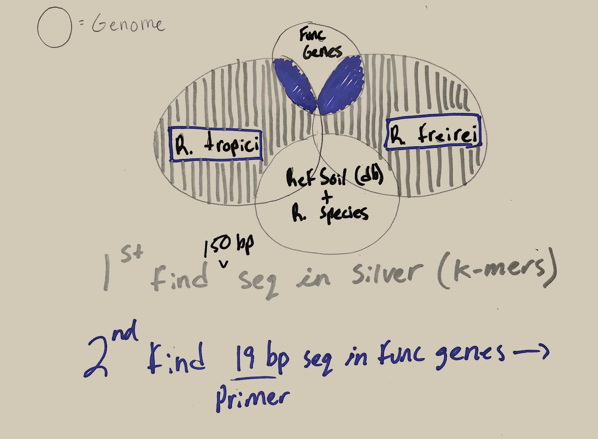

# Ederson

# List of accesion numbers in Accession_numbers_for_Jared_and_Adina.xlsx
We are interested in IDing unique sequences in G1 and G2 that are not found in other rhizobium species as well as not found in RefSoil db or RefSeq db. Once we have those identified, we will id 19 by seq to target for primer design. 


----

# G1:Rhizobium tropici CIAT 899 (+chromosome) 
1. NC_020059.1+
2. NC_020060.1
3. NC_020061.1
4. NC_020062.1

----

# G2:Rhizobium freirei PRF 81
5. NZ_AQHN01000095.1
6. NZ_AQHN01000096.1
7. NZ_AQHN1000084.1 -could not find this on NCBI

---

The python script "k-mer.py" is a script that works through refrence and comparison genomes that we choose and finds unique sequnces of lenght k (k-mer) for this script k = 150 bp. 

Download RefSoil from https://figshare.com/articles/RefSoil_Database/4362812

```{bash}
python k-mer.py refrence_genomes/NZ_AQHN01000095.1.fa refrence_genomes/NZ_AQHN01000096.1.fa refrence_genomes/NC*.fa compare_genomes/*.fa > r.freirei.mers.fa
```
